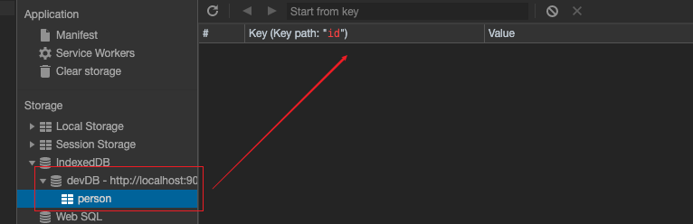

# IndexDB

## 数据库

- 打开一个数据库

`indexDB.open('自定义数据库名', 版本号)`， 打开(如不存在则是新建), 返回`IDBRequest`操作对象。

此对象常用方法有: 

`onsuccess` : 打开成功回调, 一般在这里操作对象仓库。

`onerror`: 打开失败回调

`onupgradeneeded` : 监听数据库更新, 数据库从无到有或版本升级，会于 `onsuccess` 先触发，一般在这里初始化/更新数据库。

```js
const request = indexDB.open('devDB', 1);
request.onsuccess = function(){
  const result = request.result; // 数据库对象
}
request.onerror = function (event) {
  console.log('数据库打开报错');
};
request.onupgradeneeded = function (event) {
  event.target.result; // 数据库对象
}
```

## 对象仓库(Object Storage)

创建好数据库后，通常会新建对象仓库(相当于设计表操作)。

比如，设计一个 `person` 表，主键是自增的`id` 。

```js
request.onupgradeneeded = function(event) {
  const db = event.target.result;
  const tableName = 'person';
  if (!db.objectStoreNames.contains(tableName)) {
    // 判断，如不存在才去新增。
    const objectStore = db.createObjectStore(tableName, { keyPath: 'id', autoIncrement: true 		});
  }
}
```



### 

## 数据库事务

`transaction(需访问的对象仓库名, 访问模式)` ，可以指定多个，如果只需操作单个仓库可以简写为字符串。

```js
// 以下两条等价
const personTransaction = db.transaction('person');
const personTransaction = db.transaction(['person']);
```

访问模式, 新建事务时必须指定:

- `readwrite` 读写
- `readonly` 只读

通过 `objectStore`指定要操作的表名，得到一个`IDBObjectStore`对象

```js
const personTransaction = db.transaction('person').objectStore('person');
```

### 新增

创建事务后，通过暴露出的 ` .add` 方法新增数据, 是一个异步操作。

```js
const request = personTransaction.add({name: '张三', age: 20});
request.onsuccess = function (event) {
  console.log('数据写入成功');
};
request.onerror = function (event) {
  console.log('数据写入失败');
}
```

### 更新

创建事务后，通过暴露出的 ` .put` 方法更新数据, 是一个异步操作。

```js
const transaction = this.IDBObject.transaction('person', 'readwrite').objectStore('person');
const request = transaction.put({ id: 2, name: '李四', age: 20 });
request.onerror = function (event) {};
request.onsuccess = function (event) { };
```

### 删除

创建事务后，通过暴露出的 ` .delete` 方法更新数据, 是一个异步操作。

```js
const transaction = this.IDBObject.transaction('person', 'readwrite').objectStore('person');
        const request = transaction.delete(2);
        request.onerror = function (event) { };
        request.onsuccess = function (event) { };
```

### 查询
创建事务后，通过暴露出的 ` .get` 方法查询数据, 是一个异步操作。
```js
const request = personTransaction.get(0);
request.onsuccess = function (event) {
  console.log(request.result.name);
};
request.onerror = function (event) {
  console.log('读取失败');
}
```


### 查询所有数据

创建事务后，通过暴露出的 ` .openCursor` 方法遍历数据,需要通过`continue` 继续往下执行, 是一个异步操作。

```js
const transaction = this.IDBObject.transaction('person').objectStore('person');
transaction.openCursor().onsuccess = function (evt) {
  const cursor = evt.target.result;
  if (cursor) {
    console.log(cursor.key);
    cursor.continue();
  }
}
```


## 索引

在不建索引时，数据的查询操作只能通过主键。

- 使用

在创建完仓库后，直接`createIndex`新建索引。

记得更新一下数据库版本。 `indexedDB.open('devDB', 3);` 

```js
if (!db.objectStoreNames.contains(storeName)) {
  const objectStore = db.createObjectStore('person', 
    { keyPath: 'id', autoIncrement: true}
	);
  // unique , 重复的值
  objectStore.createIndex('name', 'name', { unique: false }); // 会重复
  objectStore.createIndex('email', 'email', { unique: true });
}
```

- 使用索引查询数据

```js
const store = this.IDBObject.transaction('person', 'readonly').objectStore('person');
const index = store.index('name');
const request = index.get('李四');
request.onsuccess = function (evt) {
  var result = evt.target.result;
  console.log(result, evt);
};
```

