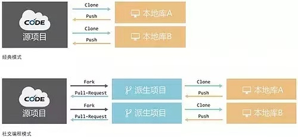
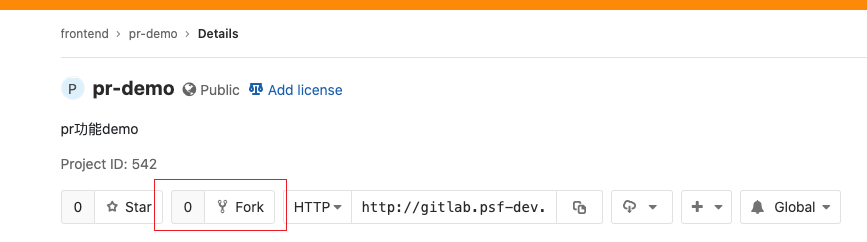
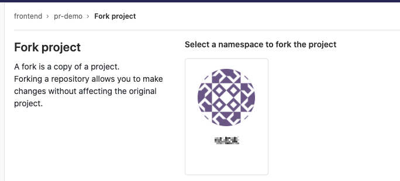
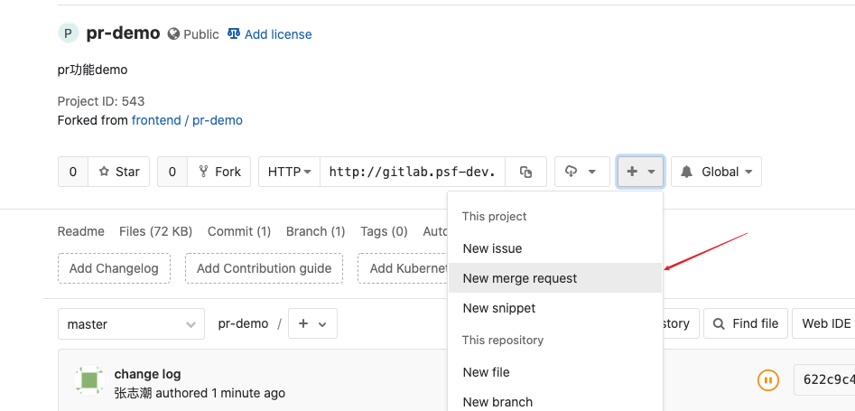
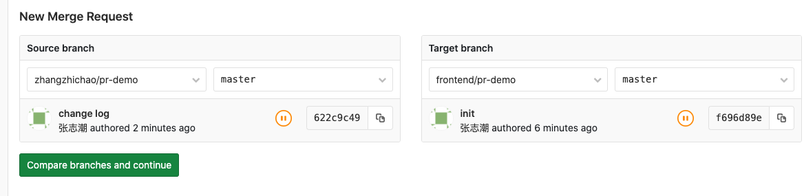
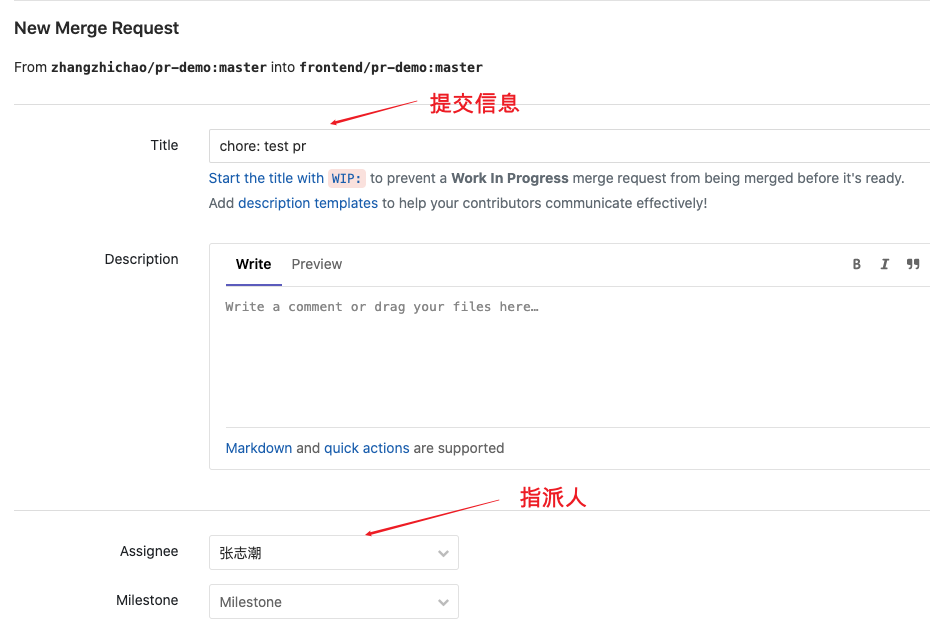
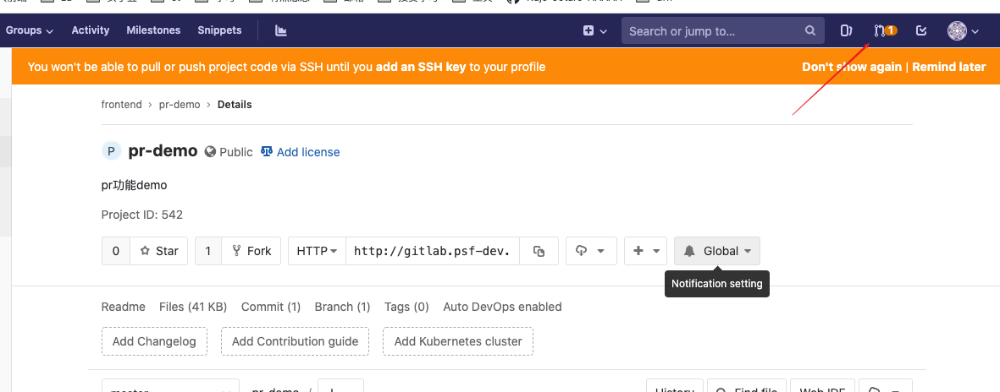
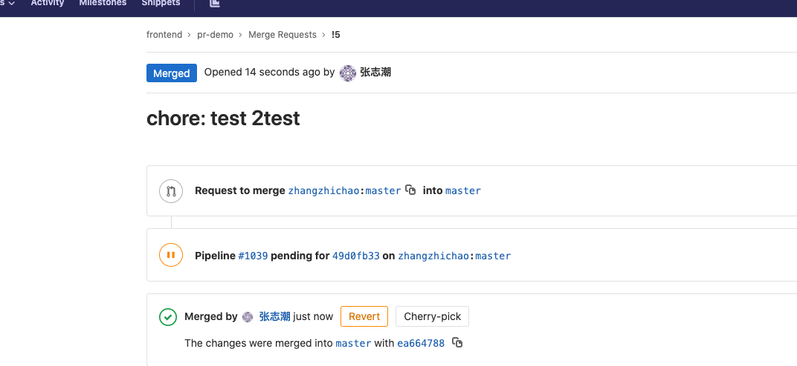

# Git-pr

## 概念



## 操作步骤

1. 点击派生, 创建自己的远端仓库






2. `clone` 自己的远程仓库

并修改文件

```bash
http://gitlab.psf-dev.com/zhangzhichao/pr-demo.git
cd pr-demo
# 修改README文件后提交至自己的远程仓库
git add .
git commit -m 'change log'
git push
```

3. 提交新的`pr`



4. 选择自己的分支与`origin`合并





4. 点击提交


### 主程界面




