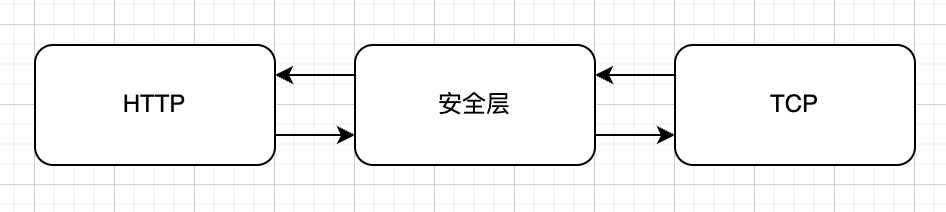
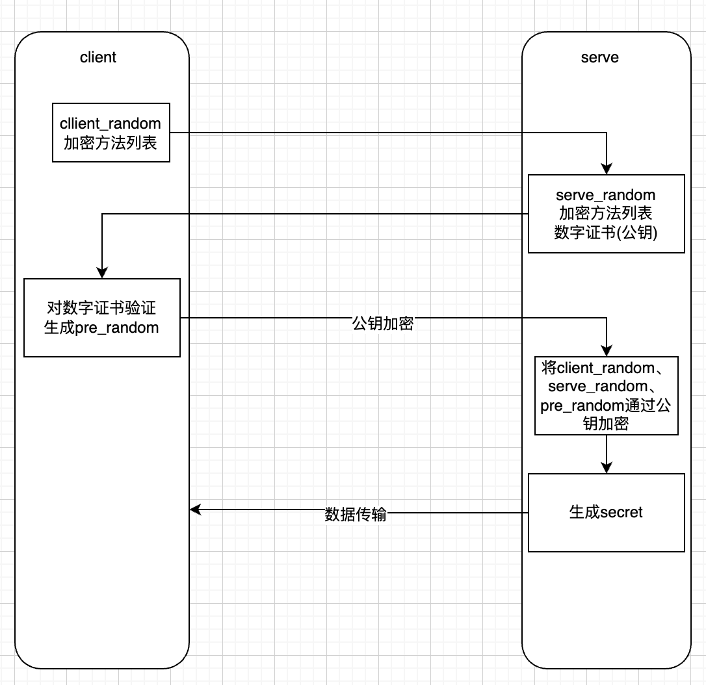

## http缓存

HTTP 缓存又分为强缓存和协商缓存

首先通过 Cache-Control 验证强缓存是否可用，如果强缓存可用，那么直接读取缓存
如果不可以，那么进入协商缓存阶段，发起 HTTP 请求，服务器通过请求头中是否带上 If-Modified-Since 和 If-None-Match 这些条件请求字段检查资源是否更新：

若资源更新，那么返回资源和 200 状态码
如果资源未更新，那么告诉浏览器直接使用缓存获取资源

**先强再缓**

## 状态码

```
HTTP 常用的状态码及使用场景？

1xx：表示目前是协议的中间状态，还需要后续请求
2xx：表示请求成功
3xx：表示重定向状态，需要重新请求
4xx：表示请求报文错误
5xx：服务器端错误

常用状态码：

101 切换请求协议，从 HTTP 切换到 WebSocket
200 请求成功，有响应体
301 永久重定向：会缓存
302 临时重定向：不会缓存
304 协商缓存命中
403 服务器禁止访问
404 资源未找到
400 请求错误
500 服务器端错误
503 服务器繁忙

```

**301和302的区别**

## HTTP 常用的请求方式，区别和用途？

```
http/1.1 规定如下请求方法：

GET：通用获取数据
HEAD：获取资源的元信息
POST：提交数据
PUT：修改数据
DELETE：删除数据
CONNECT：建立连接隧道，用于代理服务器
OPTIONS：列出可对资源实行的请求方法，常用于跨域
TRACE：追踪请求-响应的传输路径
```

### POST一般可以发送什么类型的文件

文本、图片、视频、音频等都可以
text/image/audio/ 或 application/json 等

**restful API**
**Hypermedia** : 返回结果中提供链接

## 七层网络模型

应用 表示 会话 传输 网络 链路 物理


## HTTPS 是什么？具体流程

- 定义

HTTPS 是在 HTTP 和 TCP 之间建立了一个安全层，HTTP 与 TCP 通信的时候，必须先经过一个安全层，对数据包进行加密，然后将加密后的数据包传送给 TCP，相应的 TCP 必须将数据包解密，才能传给上面的 HTTP。



- 过程

浏览器传输一个 `client_random` 和加密方法列表，服务器收到后，传给浏览器一个 `server_random`、加密方法列表和数字证书（包含了公钥），然后浏览器对数字证书进行合法验证，如果验证通过，则生成一个 pre_random，然后用公钥加密传给服务器，服务器用 client_random、server_random 和 pre_random ，使用公钥加密生成 secret，然后之后的传输使用这个 secret 作为秘钥来进行数据的加解密。



## 如何保持连接/HTTP 如何实现长连接
通过在头部（请求和响应头）设置 Connection: keep-alive，HTTP1.0协议支持，但是默认关闭，从HTTP1.1协议以后，连接默认都是长连接
在 HTTP 中响应体的 Connection 字段指定为 keep-alive

### 什么时候会过期

1. httpd 守护进程中设置`keep-alive timeout`
2. 在 HTTP 的 header 里面设置超时时间

- TCP 的 keep-alive 包含三个参数:

`tcp_keepalive_intvl`

`tcp_keepalive_probes`

`tcp_keepalive_time`

支持在系统内核的 `net.ipv4` 里面设置，当 TCP 链接之后，闲置了 tcp_keepalive_time，则会发生侦测包，如果没有收到对方的 ACK，那么会每隔 tcp_keepalive_intvl 再发一次，直到发送了 tcp_keepalive_probes，就会丢弃该链接。

```
tcp_keepalive_intvl = 15
tcp_keepalive_probes = 5
tcp_keepalive_time = 1800
```
**实际上 HTTP 没有长短链接，只有 TCP 有。**

TCP 长连接可以复用一个 TCP 链接来发起多次 HTTP 请求，这样可以减少资源消耗。

比如一次请求 HTML，可能还需要请求后续的 JS/CSS/图片等

## TCP滑动窗口(待补充)

## WebSocket与Ajax的区别

本质
生命周期
实时
发起端

## Fetch API与传统Request的区别
fetch 符合关注点分离
使用 Promise，API 更加丰富
支持 Async/Await 
语意简单，更加语意化

## TCP 如何保证有效传输及拥塞控制原理
