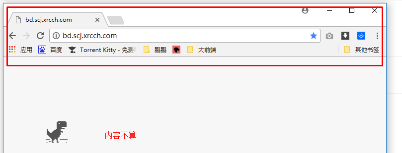
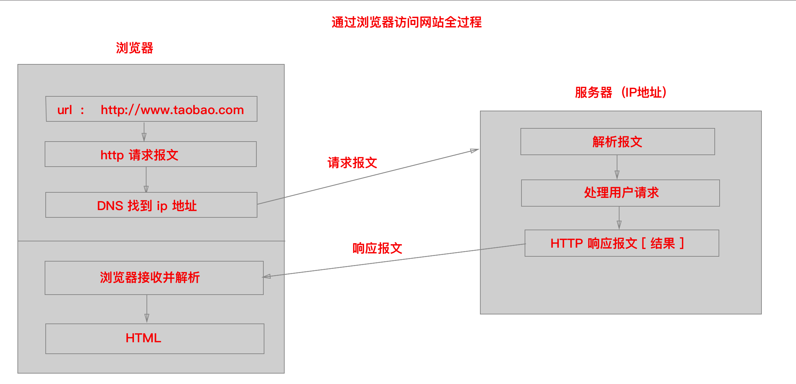
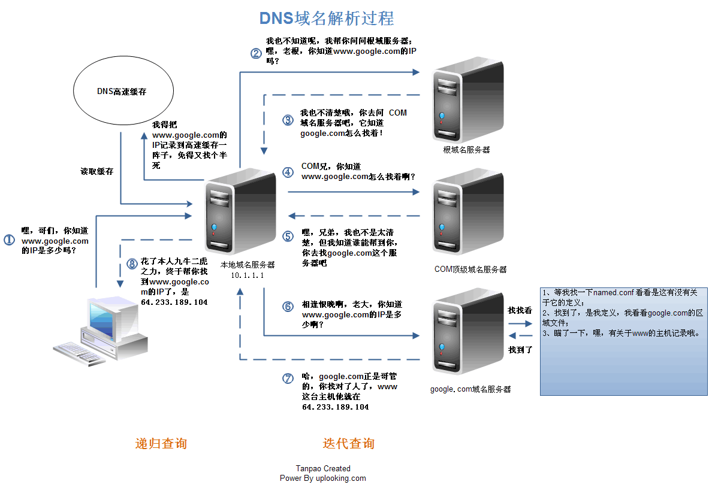
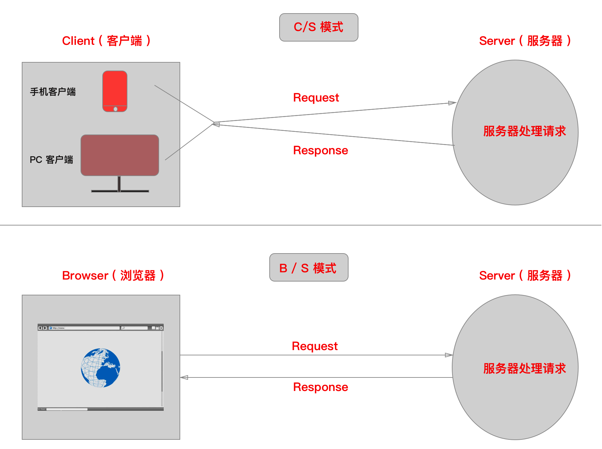

# 浏览器的基本工作原理

## 浏览器的组成

- ##### 用户界面 ( User Interface )



  - `就是浏览器的基本手动操作`

- ##### 渲染引擎（ Rendering engine )

  - 负责解析请求的内容，html、css

- ##### 浏览器引擎（ Browser engine ）

  - 在用户界面和渲染引擎之间传达指令。
  - 比如: 点击刷新...

- ##### 网络模块（Networking）

  - 用户网络调用。

  - 例如http请求，它具有平台无关的接口，可以在不同平台上工作​

- ##### UI 后端 ( UI Backend)

  - 用户绘制基本的窗口小部件, (比如:对话框、弹窗等)。

    

- ##### JS 解释器  ( JavaScript Interpreter )

  - 用来 解析 和 执行  JS 代码 。(比如chrome的javascript解释器是: js V8引擎)

```
    v8引擎: 它是谷歌研发的一种解析引擎,效率很高
    为什么效率高? 
    是因为自身的高级语言和内存策略决定的
    - 高级语言: 使用了偏底层的  C/C++, 它自身执行效率很高
    - 内存策略: 一切在运行堆栈里,无用的数据都会被强行回收,从而可以大大提高 js 代码的运行效率
    - 还有使用缓存等等其他技术
```

- ##### 数据存储  ( Data Persistence  )

  - 属于持久层

  - Cookie、HTML5中的本地存储 LocalStorage、SessionStorage）(setItem/getItem)

  - Cookie:  每次http请求都会携带Cookie 这个 字, 根据这个字段可以在两个页面之间进行传值,大小不超过4k;

  - LocalStorage 和 SessionStorage  主要是因为生命周期长短不同  最好不要超过5M 

    - SessionStorage  : 关闭浏览器就清除数据
    - LocalStorage:  需要手动清除缓存啊

  - [区别](http://blog.csdn.net/xtzz92/article/details/51668644)

- ##### 浏览器的组成图例

   

## 浏览器渲染引擎工作原理

1. **渲染引擎** 又叫 排版引擎 或 浏览器内核。—> 作用 : 用来渲染显示页面
2. 主流的 **渲染引擎** 有 :
```
Chrome浏览器: Blink引擎（WebKit引擎的一个分支）。  `拿出来,丰富了优化了`
Safari浏览器: WebKit引擎。
FireFox浏览器: Gecko引擎。
Opera浏览器: Blink引擎 (早期版使用Presto引擎）。
Internet Explorer浏览器: Trident引擎。
Microsoft Edge浏览器: EdgeHTML引擎（Trident的一个分支）。
```
3.  渲染引擎的工作原理

3.1 **解析 HTML 构建 DOM 树** ( Document Object Model, 文档对象模型 )。DOM 是W3C组织推荐的处理可扩展置标语言的标准编程接口。

3.2 **构建渲染树**。渲染树并不等同于 DOM 树,因为像`head标签 或 display: none`这样的元素不需要渲染的,故就没有必要放到*渲染树*中了，但是它们在*Dom树*中。**只渲染显示的元素**

3.3 **对渲染树进行布局**。 定位坐标和大小、确定是否换行、确定position、overflow、z-index等等，这个过程叫`layout` 或 `reflow`。

3.4 **绘制渲染树**。调用操作系统底层 API, 进行绘制操作


**[渲染引擎的工作原理图 : ]**

 

 

- WebKit工作原理（Chrome、Safari、Opera）

 

- Gecko工作原理（FireFox）

 

## 通过浏览器访问网站的全过程

输入网址 -> 构建请求报文 -> DNS 解析 -> 发送到对应 ip 服务器 -> 解析请求报文 -> 准备响应请求 -> 发送响应请求 -> 浏览器接受响应 -> 浏览器解析

1. 在浏览器地址栏中输入网址。www.taobao.com


2. 浏览器通过用户在地址栏中输入的URL构建HTTP请求报文。

```json
GET / HTTP/1.1
Host: www.taobao.com
Connection: keep-alive
Upgrade-Insecure-Requests: 1
User-Agent: Mozilla/5.0 (Windows NT 10.0; Win64; x64) AppleWebKit/537.36 (KHTML, like Gecko) Chrome/57.0.2987.133 Safari/537.36
Accept: text/html,application/xhtml+xml,application/xml;q=0.9,image/webp,*/*;q=0.8
Accept-Encoding: gzip, deflate, sdch, br
Accept-Language: zh-CN,zh;q=0.8,en;q=0.6
Cookie: l=Ag0NWp9E8X4hgaGEtIBhOmKxnSOH6kG8; isg=AkZGLTL-Yr9tHDZbgd5bsn4Rlzwg5IphaK-1BzBvMmlEM-ZNmDfacSyDfdgF; thw=cn
```

3. 浏览器发起DNS解析请求，将域名转换为IP地址。

> DNS（Domain Name System，域名系统），因特网上作为域名和[IP地址](https://baike.baidu.com/item/IP%E5%9C%B0%E5%9D%80)相互映射的一个[分布式数据库](https://baike.baidu.com/item/%E5%88%86%E5%B8%83%E5%BC%8F%E6%95%B0%E6%8D%AE%E5%BA%93)，能够使用户更方便的访问[互联网](https://baike.baidu.com/item/%E4%BA%92%E8%81%94%E7%BD%91)，而不用去记住能够被机器直接读取的IP数串。通过[主机](https://baike.baidu.com/item/%E4%B8%BB%E6%9C%BA)名，最终得到该主机名对应的IP地址的过程叫做域名解析（或主机名解析）
>
> **就是你给我名字，我帮你找家**

4. 浏览器将请求报文发送  到对应IP地址服务器。**有确切地址了就发请求过去**

5. 服务器接收请求报文,并解析。**看看你需要啥**
6. 服务器处理用户请求,并将处理结果封装成 HTTP 响应报文。**我准备给你些啥**

```js
HTTP/1.1 200 OK
Server: Tengine
Date: Thu, 13 Apr 2017 02:24:25 GMT
Content-Type: text/html; charset=utf-8
Transfer-Encoding: chunked
Connection: keep-alive
Vary: Accept-Encoding
Vary: Ali-Detector-Type, X-CIP-PT
Cache-Control: max-age=0, s-maxage=300
Via: cache8.l2cm10-1[172,200-0,C], cache13.l2cm10-1[122,0], cache3.cn206[0,200-0,H], cache6.cn206[0,0]
....
```

7. 服务器将 HTTP 响应报文发送给浏览器 **告诉你我给了啥**

8. 浏览器接收服务器相应的 HTTP 响应报文,并解析。**拿到了，开始解析**

9. 浏览器解析 HTML 页面并展示。
- 见图
  

## 在浏览器地址栏键入URL，按下回车之后会经历以下流程：

1. 浏览器向 DNS 服务器请求解析该 URL 中的域名所对应的 IP 地址;
2. 建立TCP连接（三次握手）;
3. 浏览器发出读取文件报文的数据发送给服务器;
4. 服务器对浏览器请求作出响应，并把对应的 html 文本发送给浏览器;
5. 释放 TCP连接（四次挥手）;
6. 浏览器将该 html 文本并显示内容;

## 三握四挥

- 三次握手

A 与 B 要互相了解各自的通信能力，A 给 B 发一次(1),B 收到了，了解了 A 发和自己收没问题。告诉 A (2),A 收到了 B，知道自己发和 B 发没问题。再告诉 B(3)它的发没问题。

- 四次挥手

A -> B 我没什么好说了(1)，B -> 我知道了(2),B -> A 我也没什么好说了(3),A-> B 关闭吧(4)

#### 浏览器缓存

强缓存 ? -> 协商缓存? -> 给新的

当浏览器再次访问一个已经访问过的资源时，它会这样做：

1. 看看是否命中强缓存，如果命中，就直接使用缓存了。
2. 如果没有命中强缓存，就发请求到服务器检查是否命中协商缓存。
3. 如果命中协商缓存，服务器会返回 304 告诉浏览器使用本地缓存。
4. 否则，返回最新的资源。
5. 强缓存 
   - Expires
   - Cache-control
6. 协商缓存 
   - Last-Modified/If-Modified-Since
   - Etag/If-None-Match

```ts
function Etag (url: string, isWeak: boolean) {
  // 默认hash
  const defaultHash = '"0-2jmj7l5rSw0yVb/vlWAYkK/YBwk"'
  let content = new TextEncoder().encode(fs.readFileSync(url))
  // 内容体加签获得hash
  let hash = createHash('sha1').update(content, 'utf-8').digest('base64').toString().subString(0,27)
  const etag:string = (isWeak ? 'W/' : '') + (content.length ? hash : defaultHash)
  // 缓存通知
  if (isSameEtag(req.header['If-No-Match'], etag)) {
    res.header.set(status, 304)
    res.body.set(null)
    return res
  }else {
    // 更新
    res.header.set('Etag', etag)
    return res
  }
}
```

`isWeak` : `etag`有[强弱比较](https://developer.mozilla.org/zh-CN/docs/Web/HTTP/Headers/ETag#%E8%AF%AD%E6%B3%95)

```
ETag: "33a64df551425fcc55e4d42a148795d9f25f89d4"
ETag: W/"0815"
```

弱验证器很容易生成，但不利于比较。 强验证器是比较的理想选择，但很难有效地生成。 相同资源的两个弱`Etag`值可能语义等同，但不是每个字节都相同。


## DNS 解析过程

  

> 1. 告诉`本地域名服务器` 用户输入的域名`http://www.google.com`
> 2. `本地域名服务器`说缓存里面没有这货，甩锅给 `根域名服务器`
> 3.  `根域名服务器`说我也没有，甩锅给`com顶级域名服务器 `
> 4. `com顶级域名服务器 `说你去找`google.com`这个服务器吧，他知道
> 5. 结果就找到了,返回给了`本地域名服务器`。
> 6. 然后觉得下次还这么找太累了，就让`DNS高速缓存` 缓存下来


## DOM 解析

参考代码: 

```html
<html>
  <body>
    <p>Hello World</p>
    <div> </div>
  </body>
</html>
```


 

## Webkit CSS 解析

 

## 关于CS/ BS— 架构模式

> C/S 模式：是客户端/服务器(Client/Server)模式，主要指的是传统的**桌面级的应用程序**。比如手机端上的微信, PC端上火车站售票员的售票软件。
>
> B/S模式：是浏览器/服务器(Browser/Server)模式，主要指的是**浏览器访问服务器**，就像平常使用的电子商务网站，如淘宝网页，京东网页等。
>
> 相对于C/S模式的应用程序来说，B/S模式最大的优势在于客户端只要有浏览器就可以运行。而C/S模式的应用程序需要在客户端进行安装，而且升级也不太方便。而B/S模式的应用程序对于客户端来说，永远都是最新版本的。



### 处理响应

>  服务器响应完毕后,客户端如何继续处理?

- B/S模式 :   由浏览器解析服务器返回的数据
- C/S 模式: 由 iOS、Android 客户端,解析服务器返回的数据,并且通过iOS 和 Android的 UI技术实现界面的展示功能。

## 补充链接:

## How Browsers work - 浏览器是如何工作的

[How Browsers work](http://taligarsiel.com/Projects/howbrowserswork1.htm#The_browsers_we_will_talk_about)
https://www.html5rocks.com/zh/tutorials/internals/howbrowserswork/


#### MDN

- [中文版](https://developer.mozilla.org/zh-CN/)


- [英文版](https://developer.mozilla.org/en-US/):

​      一个前端程序员交流学习、查询 API文档 的网站.  推荐指数 :  ★★★★★

